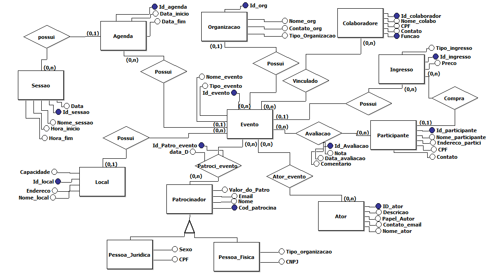
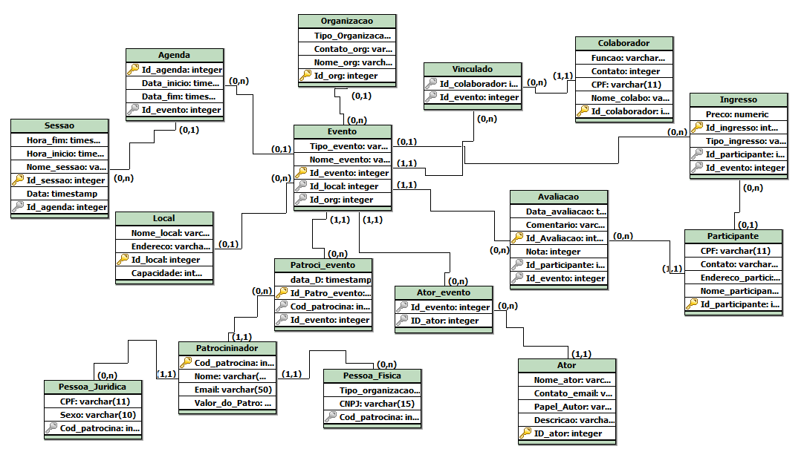

# Sistema de Gerenciamento de Eventos — Banco de Dados

Projeto de modelagem e implementação de banco de dados relacional para um sistema de gerenciamento de eventos (shows, palestras, conferências), desenvolvido para a disciplina de Banco de Dados I (UFSC — Campus Araranguá).

O sistema cobre o ciclo completo: modelagem conceitual → modelo lógico → script físico SQL → implementação em Python (CRUD + consultas de negócio) → visualização dos resultados.

## O problema

Organizações que promovem eventos com múltiplas sessões, patrocinadores, ingressos e avaliações precisam de uma estrutura de dados que suporte relacionamentos complexos (um evento pode ter vários patrocinadores, vários colaboradores, uma agenda com múltiplas sessões) sem duplicar ou perder informação.

## Modelo Conceitual



Principais entidades: Evento, Organização, Local, Agenda/Sessão, Participante, Ingresso, Colaborador, Ator (palestrante/artista), Patrocinador (com especialização em Pessoa Física / Pessoa Jurídica) e Avaliação.

## Modelo Lógico



Conversão do modelo conceitual para o modelo relacional, com chaves primárias, estrangeiras e cardinalidades definidas — desenvolvido com a ferramenta [brModelo](https://sourceforge.net/projects/brmodeloii/).

## Estrutura do projeto

```
├── Script.sql          # Script físico do modelo (DDL)
├── main.py             # Implementação em Python: CRUD, testes e consultas
├── requirements.txt    # Dependências Python
├── .env.example         # Modelo de variáveis de ambiente (copie para .env)
└── modelos_visuals/
    ├── modelo_conceitual.png
    └── modelo_logico.png
```

## Como rodar

1. Clone este repositório
2. Instale as dependências:
   ```
   pip install -r requirements.txt
   ```
3. Copie `.env.example` para `.env` e preencha com suas credenciais do MySQL:
   ```
   cp .env.example .env
   ```
4. Crie o banco `bd_evento` no MySQL (vazio — as tabelas são criadas pelo próprio script)
5. Execute:
   ```
   python main.py
   ```
6. Use o menu interativo para criar as tabelas, popular com dados de teste e rodar as consultas

## Consultas de negócio implementadas

| # | Consulta |
|---|---|
| 1 | Faturamento total das organizações que promoveram eventos do tipo "show" |
| 2 | Total de patrocínio recebido por organização, somando todos os eventos que organizou |
| 3 | Total de ingressos vendidos para eventos que receberam pelo menos uma avaliação |
| Extra | Valor de patrocínio e vendas de ingresso para eventos com artistas específicos (Wizkid, Burna Boy, Asake) |

## Ferramentas utilizadas

- **MySQL** — banco de dados relacional
- **Python** — `mysql-connector-python`, `python-dotenv`
- **brModelo** — modelagem conceitual e lógica
- **Excel** — visualização dos resultados das consultas

---
